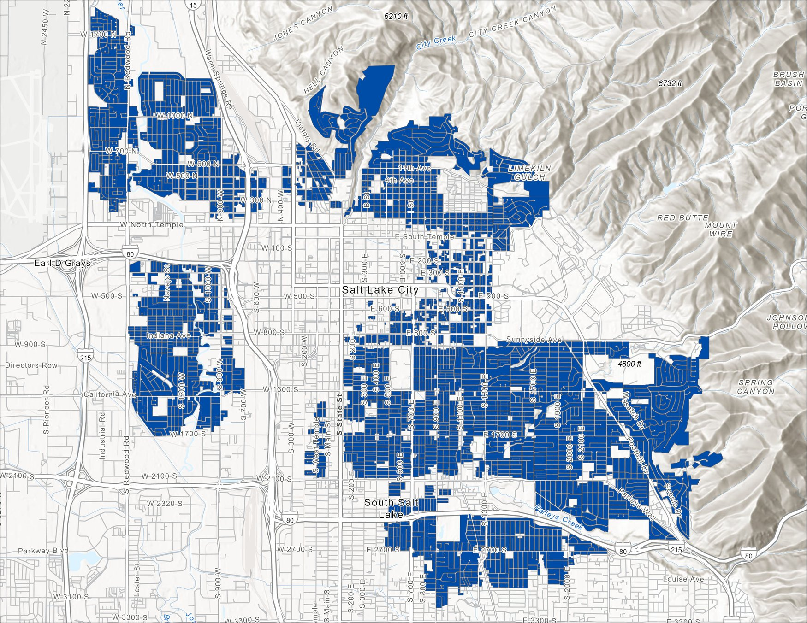
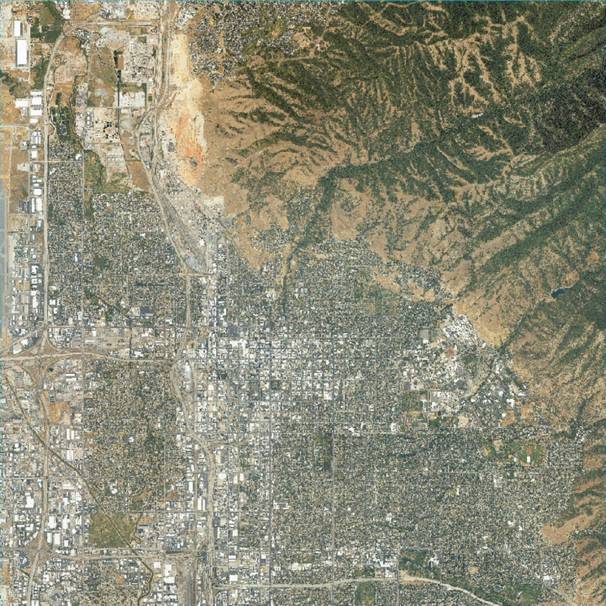
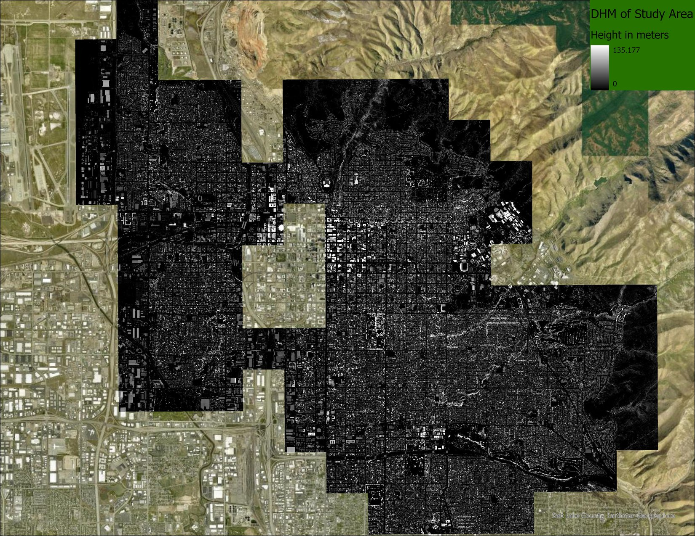
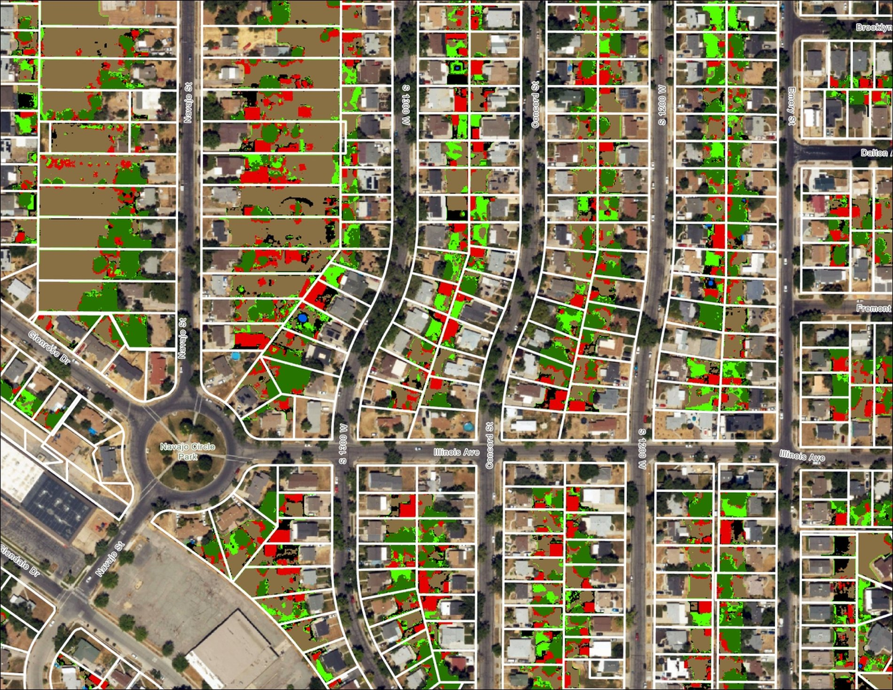
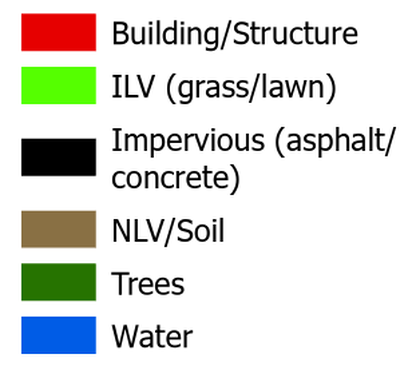
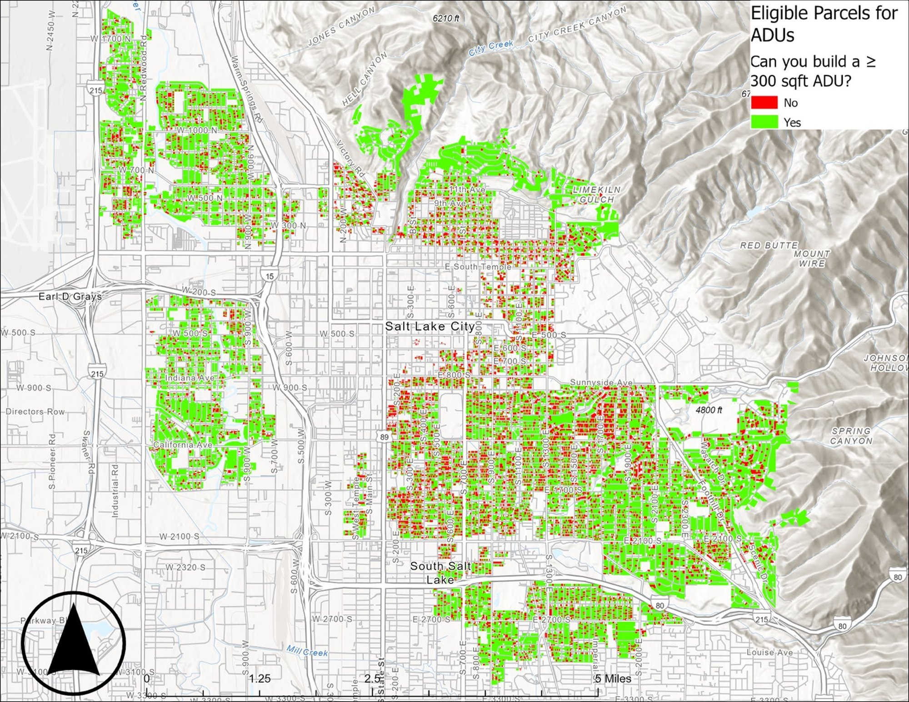
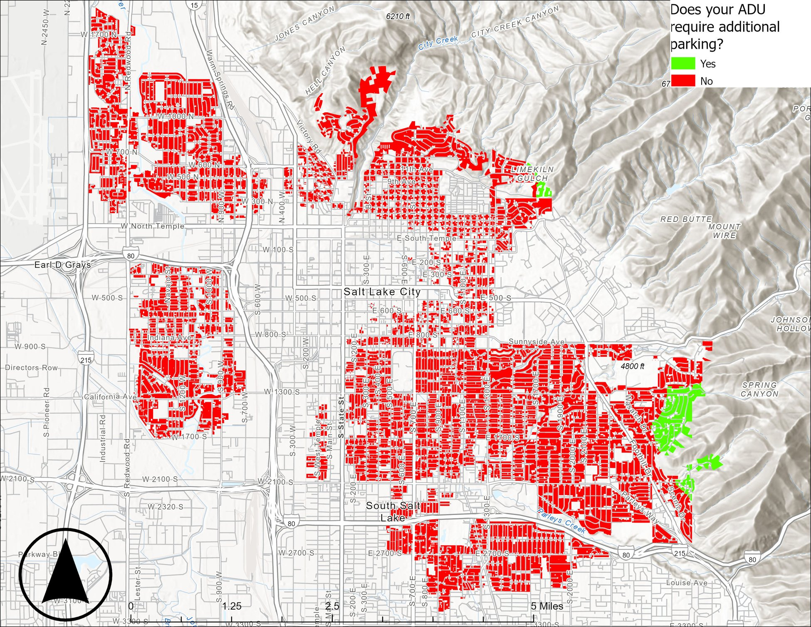
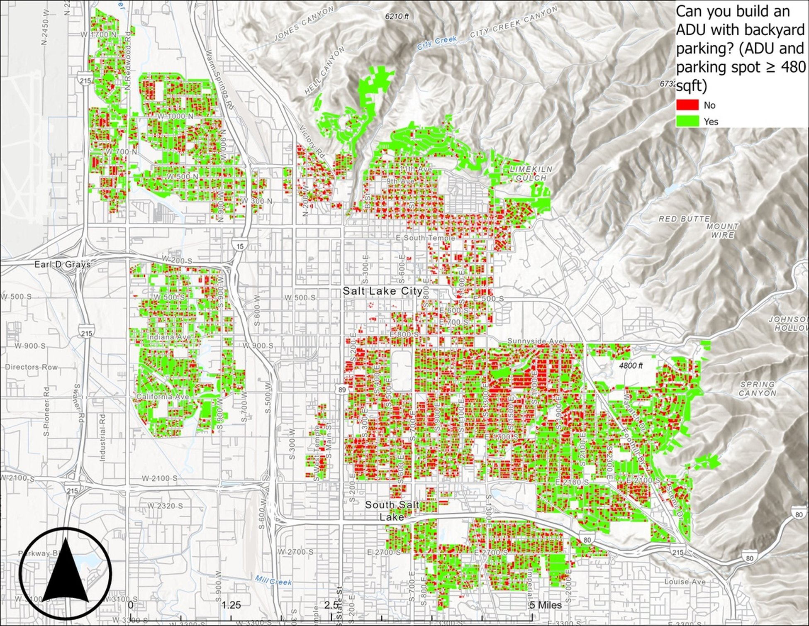

**MEMORANDUM**

**To:** Salt Lake City Planning Division

**From:** Gus Stephens

**Date:** July 29, 2026

**Re:** Estimating citywide capacity for detached accessory dwelling units using aerial imagery, LiDAR, and machine learning

# **Summary**

Salt Lake City has allowed accessory dwelling units (ADUs) on single-family lots citywide since 2018, but the city has not had a parcel-level estimate of how much backyard space is physically available to build them. This analysis pairs 2024 aerial imagery with 2023 LiDAR elevation data to map open, buildable ground in the backyard of every non-corner ADU-eligible parcel, after applying the setback and separation rules in the city\'s ADU Handbook.

Key findings:

-   **23,485 detached ADUs** could physically fit in backyards citywide, spread across 34,535 eligible and ideal parcels.

-   **18,677 of those parcels (80%)** have room for both a minimum-size unit and an off-street parking space in the backyard.

-   **98% of ADU-capable parcels** fall within the transit or bikeway distances that waive the added parking requirement.

-   Capacity is unevenly distributed: **Council District 7** has the most room (5,338 units) and **Council District 4** the least (804 units).

-   **Building only the parking-capable subset** **would raise the city\'s housing stock by roughly** **19%**, from 97,318 to 115,995 units (U.S. Census Bureau, 2023).

These figures describe physical capacity, not expected production. They are best used to quantify the opportunity to build ADUs and to target outreach.

# **I. Background and purpose**

Salt Lake City and Utah more broadly face a housing crisis where the supply of housing cannot keep up with demand (Jeremias, 2024). One way the city responded to this crisis in 2018 was to update its zoning ordinance to allow accessory dwelling units in the backyards of single-family zoned properties (Riddle, 2018). An ADU is a secondary housing unit built on the same lot as a primary residence: a separate, self-contained living space with its own entrance, kitchen, and bathroom. ADUs can be detached, attached, or interior (Salt Lake City Planning Division, n.d.). This analysis addresses detached units only.

Knowing where ADUs are permitted is not the same as knowing whether one will physically fit. A parcel may be correctly zoned and still have no open ground left once setbacks, the primary structure, trees, driveways, and paved surfaces are accounted for. The purpose of this analysis is to close that gap with a measured, parcel-level estimate.

ADUs also offer several benefits at once. They add housing supply at lower cost than multifamily construction since there is no land acquisition cost and they tend to draw less neighborhood opposition than larger projects. ADUs can allow longtime residents to age in place by moving into the smaller unit while renting out or sharing the main house. Additionally, they can give homeowners a path to rental income or equity, and if state law were to permit lot splits and the sale of ADUs as condominiums, as California now does, they could eventually serve as entry-level ownership housing (Levin, 2025).

# **II. Study area and data**

The study area covers parcels in zones where ADUs are permitted and ideal: SR-1, R-2, R-1-7000, R-1-5000, R-1-12000, RMF-30, FR-1, FR-2, and FR-3.

{width="4.583333333333333in" height="3.5416666666666665in"}

*Figure 1. ADU-eligible and ideal-zoned parcels, Salt Lake City.*

Within each parcel, the buildable backyard was delineated by treating the largest building footprint as the primary structure, drawing a line from that structure to the nearest street, and splitting the parcel perpendicular to that line into front and rear yards. This method was adapted from Ossola et al. (2019). The ADU Handbook requirements were then applied as buffers: a three-foot setback from all parcel edges and a ten-foot separation from the primary structure and from neighboring primary structures. Parcels left with less than 300 square feet of remaining space, the practical minimum for a studio unit under the International Building Code, were dropped. Corner lots were excluded, since the ADU Handbook applies different setback rules to them. After all filters, 34,535 backyards remained.

Four data sources support the analysis:

-   2024 NAIP aerial imagery --- red, green, blue (RGB) imagery at 15 cm resolution and near-infrared imagery at 60 cm, from the Utah Geospatial Resource Center (UGRC).

-   2023 LiDAR digital surface and elevation models at 50 cm, flown by Aero-Graphics for the Utah Division of Emergency Management and distributed by UGRC.

-   Parcel boundaries and November 2024 building footprints from Salt Lake County; zoning, council districts, roads, and sidewalks from the city\'s open data portal.

-   Transit stops, TRAX lines, and bike facilities from UGRC and the Utah Transit Authority, used for the parking analysis.

Subtracting the elevation model from the surface model yields the height of everything standing on the ground. That layer is what allows for better differentiation between a lawn from a tree canopy and an asphalt driveway from a shingled rooftop.

{width="3.9583333333333335in" height="3.9583333333333335in"}

*Figure 2. Original 270-image NAIP mosaic of Salt Lake City.*

{width="4.375in" height="3.3854166666666665in"}

*Figure 3. Mosaic of 103 LiDAR height images across the ADU-eligible and ideal zoning area.*

# **III. How land cover was classified**

The imagery layers were aligned to a common 50 cm grid, combined into a single image containing RGB, near-infrared, and height and clipped to the backyard study areas. A random forest classifier, which is a commonly used machine-learning method for land cover mapping and has previously been used on NAIP data of Salt Lake City (Reynolds, 2017), was trained on manually collected sample areas and then applied to sort every 50 cm cell into one of six categories. In practice, the model builds hundreds of simple decision rules from areas of known land cover, then lets each rule "vote" on what every other cell in the image most likely represents. Combining many independent votes, rather than relying on a single rule, is what makes the approach reliable across a citywide image with wide variation in lot size, vegetation, and shadow. Below are the six classification categories.

-   Buildings and structures

-   Impervious surfaces (driveways, patios, walkways)

-   Water

-   Trees

-   **Irrigated low-stature vegetation (ILV)** --- maintained lawn and groundcover

-   **Non-irrigated low-stature vegetation / soil (NLV/Soil)** --- dry grass and dirt

The last two categories are the ones used to calculate ADU buildout and siting. They represent open ground that could be built on with the least disturbance to trees or existing structures, and without removing paved surfaces. Buildable area per parcel was calculated by summing those cells, and a parcel was counted as ADU-capable if it held at least 300 square feet of them.

{width="5.0in" height="3.8645833333333335in"}

{width="1.8229166666666667in" height="1.6041666666666667in"}

*Figure 4. Example of classified ADU backyards, with land cover legend.*

# **IV. Reliability of the classification**

Accuracy was measured against independently collected ground-truth areas that the model never saw during training. Overall accuracy was 86%, yet that figure understates performance where it counts most: the two categories that drive the capacity estimate, ILV and NLV/Soil, were correctly identified on the ground 94% and 95% of the time.

Height was by far the most influential input, ranking far above every other variable in the model\'s feature importance scores and demonstrating the value of utilizing LiDAR in an urban planning analysis. Some of the remaining errors sit in categories that don\'t affect the total ADU estimate. For instance, some rooftops are read as tree canopy where overhanging branches and shadow obscure them, since both are non-buildable classes. Others do affect it directly: some pavement is read as bare soil, since dry, rocky ground and weathered concrete are spectrally similar, which is part of why the buildable-area figures should be read as an upper bound, as discussed below.

**Classification accuracy by land cover type**

  -------------------------------------------------------------------------------------
  **Land cover type**                     **Producer accuracy**   **User accuracy**
  --------------------------------------- ----------------------- ---------------------
  Irrigated low vegetation (ILV)          94%                     88%

  Non-irrigated vegetation (NLV) / soil   95%                     82%

  Trees                                   94%                     81%

  Water                                   98%                     93%

  Buildings and structures                81%                     91%

  Impervious surfaces                     71%                     94%
  -------------------------------------------------------------------------------------

*Producer accuracy is the share of true ground area of that class that the model correctly found. User accuracy is the share of the area assigned to that class that was actually correct.*

For the two classes that drive the ADU estimate, ILV and NLV/Soil, producer accuracy averages roughly 95% while user accuracy averages roughly 85%. These measure different things, and the gap between them matters for how the citywide total should be read. Producer accuracy asks: of all the real lawn and bare soil on the ground, how much did the model find? At 95%, the model is not missing meaningful amounts of buildable space. User accuracy asks the reverse: of everything the model labeled buildable, how much of that label can be trusted? At roughly 85%, about one area in seven labeled "buildable" is actually something else, typically a patch of pavement. Because the ADU count is built by summing area labeled buildable, this asymmetry means the citywide estimate is more likely to run slightly high than slightly low. The 23,485 figure is best read as an upper bound on physical capacity for all non-corner parcels in the city.

# **V. Estimated ADU capacity**

Across the 34,535 eligible backyards, 23,485 hold enough open ground for a studio-size detached unit. District 4 has the least capacity, which follows from its position in the urban core, where parcels are smaller and more of each lot is already covered. District 7 has the greatest ADU buildout potential.

**Potential detached ADUs by council district**

  -----------------------------------------------------------------------
  **Council district**                     **Potential ADUs**
  ---------------------------------------- ------------------------------
  District 1                               3,805

  District 2                               3,556

  District 3                               2,530

  District 4                               804

  District 5                               3,292

  District 6                               4,160

  District 7                               5,338

  **Citywide total**                       **23,485**
  -----------------------------------------------------------------------

{width="5.0in" height="3.8645833333333335in"}

*Figure 5. Parcels with enough backyard space to build a detached ADU.*

# **VI. Parking**

According to the ADU Handbook, the added off-street parking requirement is waived when a property lies within a quarter mile of a transit stop or a half mile of a bike route. Ninety-eight percent of ADU-capable parcels fall within those transit or bike route buffers. Only District 6 is meaningfully affected, at 90%.

{width="4.791666666666667in" height="3.6979166666666665in"}

*Figure 6. Parcels allowed to build an ADU without being required to add off-street parking.*

**ADUs by council district not required to provide extra parking**

  -------------------------------------------------------------------------------------------
  **Council district**   **Parking not required**   **Total ADUs**   **Share not required**
  ---------------------- -------------------------- ---------------- ------------------------
  District 1             3,805                      3,805            100%

  District 2             3,556                      3,556            100%

  District 3             2,503                      2,530            99%

  District 4             804                        804              100%

  District 5             3,292                      3,292            100%

  District 6             3,739                      4,160            90%

  District 7             5,338                      5,338            100%

  **Citywide total**     **23,037**                 **23,485**       **98%**
  -------------------------------------------------------------------------------------------

Nonetheless, parking is unlikely to be a binding constraint even where it is required. Single-family homes typically provide two parking spaces, and existing garages and driveways are often large enough to absorb a tenant\'s vehicle. Still, the classified imagery can determine whether a backyard has room for off-street parking as well. Assuming roughly 180 square feet per space alongside a 300-square-foot unit, 18,677 parcels (80% of those that can host an ADU at all) have room for both.

**Capacity to accommodate a unit plus off-street parking in backyard**

  --------------------------------------------------------------------------------------------------------------------
  **Council district**   **Total ADUs**   **ADU + parking in back**   **Share that can build ADU + parking in back**
  ---------------------- ---------------- --------------------------- ------------------------------------------------
  District 1             3,805            3,220                       85%

  District 2             3,556            3,080                       87%

  District 3             2,530            2,034                       80%

  District 4             804              583                         73%

  District 5             3,292            2,295                       70%

  District 6             4,160            3,221                       77%

  District 7             5,338            4,244                       80%

  **Citywide total**     **23,485**       **18,677**                  **80%**
  --------------------------------------------------------------------------------------------------------------------

{width="4.791666666666667in" height="3.7083333333333335in"}

*Figure 7. Parcels with room for both an ADU and a backyard off-street parking space.*

# **VII. Limitations and next steps**

Several caveats should travel with these numbers:

-   **This is physical capacity, not forecasted production.** The estimate does not account for owner interest, financing, utility connections, or landscaping a homeowner wants to keep.

-   **The estimate likely runs slightly high, not low.** As discussed in Section IV, user accuracy for the buildable classes is lower than producer accuracy, which biases the count toward a modest overstatement of open ground.

-   **Slope is not yet accounted for.** Adding a slope filter from the digital elevation model that would exclude parcels above roughly 30 degrees would trim the count of potential ADUs, particularly near the foothills and in the East Bench.

-   **Corner lots are excluded entirely,** so the citywide figure is an undercount on this front, a separate effect from the accuracy-driven overestimate discussed above. A corner-lot delineation method has since been developed and could be incorporated in a future update to increase the citywide and council district totals.

-   **Results are least reliable at yard edges** where the imagery resampling method introduces some noise.

For any parcel where the city intends to act on these results e.g. outreach, a pilot program, a pre-approved plan set, a site visit or a look at current imagery should confirm the findings.

# **VIII. Conclusion**

Combining aerial imagery with LiDAR-derived height data produces a reliable, citywide estimate of where detached ADUs will physically fit, at a level of detail that would be impractical to assemble in person and more accurate than an approach relying on parcel and building footprint data alone. The result is substantial: roughly 23,485 units that are already allowed under current zoning, four fifths of which could accommodate parking as well. Even modest take-up would move the city meaningfully toward its housing targets, and the parcel-level outputs (shapefile, excel file, and parcel-level ADU suitability web map) can be handed directly to outreach, pre-approved plan, or program-design efforts.

# **Sources**

Jeremias, S. (2024, March 8). 5 numbers that show just how bad Utah\'s housing crisis is. The Salt Lake Tribune.

Levin, E. (2025, August 14). San José developers pioneer new California law: selling ADUs as condos. CapRadio.

Ossola, A., Locke, D., Lin, B., & Minor, E. (2019). Greening in style: Urban form, architecture and the structure of front and backyard vegetation. Landscape and Urban Planning, 185, 141--157.

Reynolds, J. D. (2017). Comparing urban vegetation cover with summer land surface temperature in the Salt Lake Valley \[Master\'s thesis, University of Utah\]. J. Willard Marriott Digital Library.

Riddle, I. (2018, October 17). Salt Lake City now has a city-wide ADU ordinance. Building Salt Lake.

Salt Lake City Planning Division. (n.d.). Accessory Dwelling Units (ADU) Handbook.

U.S. Census Bureau. (2023). American Community Survey 5-year estimates, via Social Explorer.
